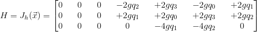
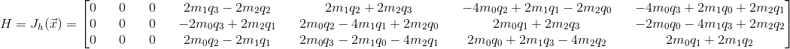

# Module Description
The Ahrs_ekf modules updates the ahrs structure using an extended kalman filter with updates from the accelerometer and magnetometer.

### Accelerometer Update Derivation
We need to determine the measurement matrix (H) for the kalman filter. This is done by predicting what the measurement would be at any given attitude (h) and then obtaining the Jacobian matrix of that.

The state vector given in the Ahrs_ekf module is given as:
<!-- \vec{x} = \begin{bmatrix} b_x \\ b_y \\ b_z \\ q_0 \\ q_1 \\ q_2 \\ q_3 \end{bmatrix} -->

where b in the gyroscope biases and q is the ahrs quaternion.

The acceleration vector is the following:
<!-- \vec{a} = \begin{bmatrix} 0 \\ 0 \\ g \end{bmatrix} -->

g is positive as the positive z direction points towards the ground.

As we want to rotate the vector in the opposite direction of the ahrs quaternion, we can negate the i, j, and k component of the quaternion to get this rotation.
<!-- \vec{q} = \begin{bmatrix} q_0 \\ -q_1 \\ -q_2 \\ -q_3  \end{bmatrix} -->

As per the quaternions_rotate_vector function in quaternions.h, we compute the following steps in order to rotate the vector.
<!-- \vec{tmp}_1 = \begin{vmatrix} \vec{\imath} && \vec{\jmath} && \vec{k} \\ -q_1 && -q_2 && -q_3 \\ 0 && 0 && g \end{vmatrix} -->

<!-- \vec{tmp}_1 = \begin{bmatrix} -g q_2 \\ +g q_1 \\ 0 \end{bmatrix} -->

<!-- \vec{tmp}_1 = 2 \vec{tmp}_1 -->

<!-- \vec{tmp}_1 = \begin{bmatrix} -2 g q_2 \\ +2 g q_1 \\ 0 \end{bmatrix} -->

<!-- \vec{tmp}_2 = \begin{vmatrix} \vec{\imath} && \vec{\jmath} && \vec{k} \\ -q_1 && -q_2 && -q_3 \\ -2 g q_2 && +2 g q_1 && 0 \end{vmatrix} -->

<!-- \vec{tmp}_2 = \begin{bmatrix} 2 g q_1 q_3 \\ 2 g q_2 q_3 \\ -2 g q_1^2 - 2 g q_2^2 \end{bmatrix} -->

<!-- \vec{h} = \vec{a} + q_0 * \vec{tmp}_1 + \vec{tmp}_2 -->

Our final rotated vector is:
<!-- \vec{h} = \begin{bmatrix} -2 g q_0 q_2 + 2 g q_1 q_3 \\ +2 g q_0 q_1 + 2 g q_2 q_3 \\ g - 2 g q_1^2 - 2 g q_2^2 \end{bmatrix} -->

In order to obtain the measurement matrix in the kalman filter, we take the Jacobian of h with respect to the state vector.
<!-- H = J_h(\vec{x}) = \begin{bmatrix} 0 && 0 && 0 && -2 g q_2 && +2 g q_3 && -2 g q_0 && +2 g q_1 \\ 0 && 0 && 0 && +2 g q_1 && +2 g q_0 && +2 g q_3 && +2 g q_2 \\ 0 && 0 && 0 && 0 && -4 g q_1 && -4 g q_2 && 0 \end{bmatrix} -->
<!-- For some reason, the website limits the matrix to 5 columns -->

### Magnetometer Update Derivation
We need to determine the measurement matrix (H) for the kalman filter. This is done by predicting what the measurement would be at any given attitude (h) and then obtaining the Jacobian matrix of that.

The state vector given in the Ahrs_ekf module is given as:
<!-- \vec{x} = \begin{bmatrix} b_x \\ b_y \\ b_z \\ q_0 \\ q_1 \\ q_2 \\ q_3 \end{bmatrix} -->

where b in the gyroscope biases and q is the ahrs quaternion.

The magnetometer vector is the following:
<!-- \vec{m} = \begin{bmatrix} m_0 \\ m_1 \\ m_2 \end{bmatrix} -->

As we want to rotate the vector in the opposite direction of the ahrs quaternion, we can negate the i, j, and k component of the quaternion to get this rotation.
<!-- \vec{q} = \begin{bmatrix} q_0 \\ -q_1 \\ -q_2 \\ -q_3  \end{bmatrix} -->

As per the quaternions_rotate_vector function in quaternions.h, we compute the following steps in order to rotate the vector.
<!-- \vec{tmp}_1 = \begin{vmatrix} \vec{\imath} && \vec{\jmath} && \vec{k} \\ -q_1 && -q_2 && -q_3 \\ m_0 && m_1 && m_2 \end{vmatrix} -->

<!-- \vec{tmp}_1 = \begin{bmatrix} m_1 q_3 - m_2 q_2\\ -m_0 q_3 + m_2 q_1 \\ m_0 q_2 - m_1 q_1 \end{bmatrix} -->

<!-- \vec{tmp}_1 = 2 \vec{tmp}_1 -->

<!-- \vec{tmp}_1 = \vec{tmp}_1 = \begin{bmatrix} 2 m_1 q_3 - 2 m_2 q_2\\ -2 m_0 q_3 + 2 m_2 q_1 \\ 2 m_0 q_2 - 2 m_1 q_1 \end{bmatrix} -->

<!-- \vec{tmp}_2 = \begin{vmatrix} \vec{\imath} && \vec{\jmath} && \vec{k} \\ -q_1 && -q_2 && -q_3 \\ 2 m_1 q_3 - 2 m_2 q_2 && -2 m_0 q_3 + 2 m_2 q_1 && 2 m_0 q_2 - 2 m_1 q_1 \end{vmatrix} -->

<!-- \vec{tmp}_2 = \begin{bmatrix} -2 m_0 q_2^2 - 2 m_0 q_3^2 +2 m_1 q_1 q_2 + 2 m_2 q_1 q_3 \\ 2 m_0 q_1 q_2 - 2 m_1 q_1^2 - 2 m_1 q_3^2 + 2 m_2 q_2 q_3 \\ 2 m_0 q_1 q_3 + 2 m_1 q_2 q_3 - 2 m_2 q_1^2 - 2 m_2 q_2^2 \end{bmatrix} -->

<!-- \vec{h} = \vec{a} + q_0 * \vec{tmp}_1 + \vec{tmp}_2 -->

Our final rotated vector is:
<!-- \vec{h} = \begin{bmatrix} m_0 - 2 m_0 q_2^2 - 2 m_0 q_3^2 + 2 m_1 q_0 q_3 + 2 m_1 q_1 q_2 - 2 m_2 q_0 q_2 + 2 m_2 q_1 q_3 \\ m_1 - 2 m_0 q_0 q_3 + 2 m_0 q_1 q_2 - 2 m_1 q_1^2 -2 m_1 q_3^2 + 2 m_2 q_0 q_1 + 2 m_2 q_2 q_3 \\ m_2 + 2 m_0 q_0 q_2 + 2 m_0 q_1 q_3 - 2 m_1 q_0 q_1 + 2 m_1 q_2 q_3 - 2 m_2 q_1^2 - 2 m_2 q_2^2\end{bmatrix} -->

In order to obtain the measurement matrix in the kalman filter, we take the Jacobian of h with respect to the state vector.
<!-- H = J_h(\vec{x}) = \begin{bmatrix} 0 && 0 && 0 && 2 m_1 q_3 - 2 m_2 q_2 && 2 m_1 q_2 + 2 m_2 q_3 && -4 m_0 q_2 + 2 m_1 q_1 - 2 m_2 q_0 && -4 m_0 q_3 + 2 m_1 q_0 + 2m_2 q_1 \\ 0 && 0 && 0 && -2 m_0 q_3 + 2 m_2 q_1 && 2 m_0 q_2 -4 m_1 q_1 +2 m_2 q_0 && 2 m_0 q_1 + 2 m_2 q_3 && -2 m_0 q_0 - 4 m_1 q_3 + 2 m_2 q_2 \\ 0 && 0 && 0 && 2 m_0 q_2 - 2 m_1 q_1 && 2 m_0 q_3 - 2 m_1 q_0 - 4 m_2 q_1 && 2 m_0 q_0 + 2 m_1 q_3 -4 m_2 q_2 && 2 m_0 q_1 + 2 m_1 q_2 \end{bmatrix} -->
<!-- For some reason, the website limits the matrix to 5 columns -->

