## Power  

### Power regulators
4 power regulators provide the board with different stable voltages. Two regulators are lm2734 chip, an adjustable voltage regulator controlled by a voltage divider on a feedback pin. The output voltage is defined with the following formula.
```
Vout == Vref * (1 + R1 / R2)
Vref = 0.8V
R2 = 10k
```
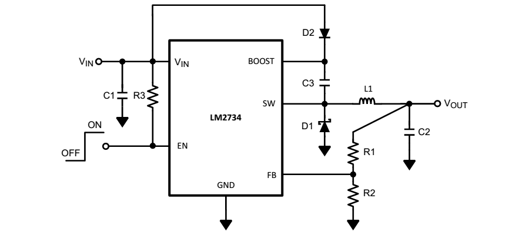  
The two other regulators provide fix stable voltage, 3.3 and 5 Volts for analogical measurements.  
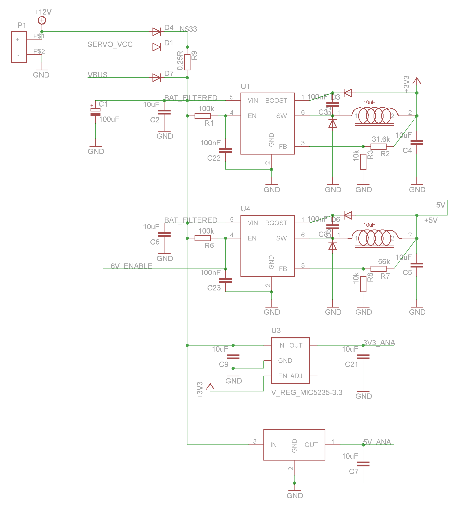
On revision 4.1.1, a resistor of 56k is mounted in order to provide 5.2 Volts. On revision 4 and 4.1, a resistor of 68k is mounted to provide 6 Volts.

### Voltages measurement
For measuring the voltages on the board, analogic port are connected to voltage dividers. By reading these ports, input voltages can be monitored by the microcontroller.
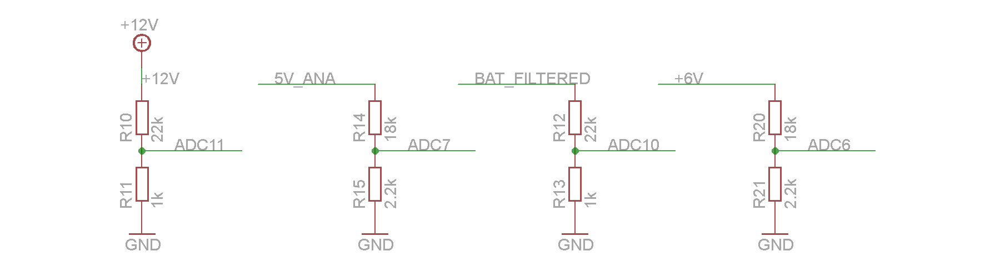
From the voltage read on these 4 ports, the microcontroller can detect if the board is powered with a battery or an external source (Speed controllers or USB bus).

## Microcontroller
The core of the electronic board is the microcontroller, a Atmel AVR 32 bits, the AT32UC3C1512. All the sensors and communication devices are connected to the microcontroller. The microcontroller connections are presented in the two following schematics.
### Left side Schematic
The different signals connected to the microcontroller are:
* SW_RECEIVER: Enable the power supply of the Remote Control Receiver
* SDA0 and SCL0: I2C bus lines connected to the barometer, compass and IMU
* SDA1 and SCL1: Data and Clock lines of the external I2C bus connectors
* PWM0-7: PWM signals connected to the servos connector
* CAN*: CAN bus lines connected to the CAN bus device
* SPI0_*: External SPI bus connected to the SPI 7-pins header
* D_TXD: 

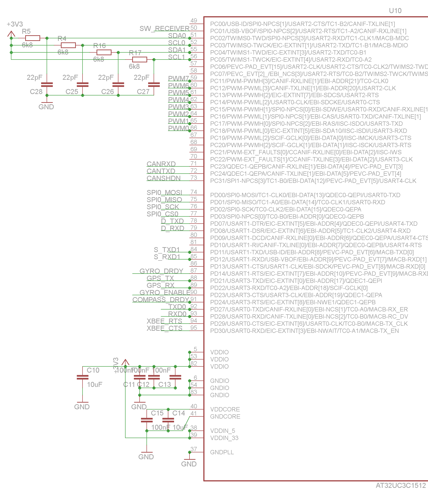
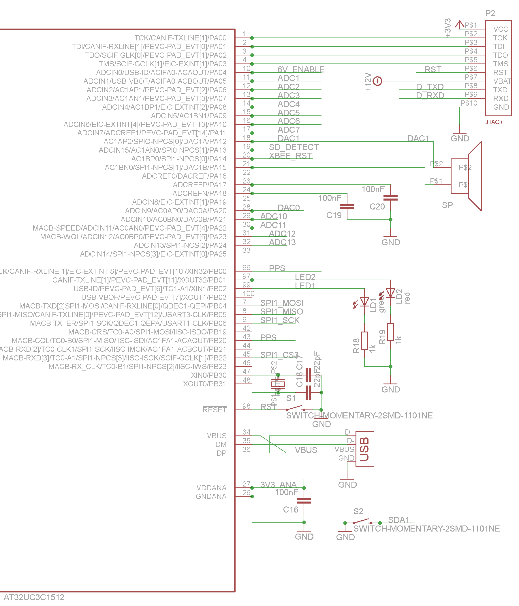

## Sensors

The PCB contains different onboard sensors, a barometer used for a relative altitude estimation, a compass used for the heading direction and an Inertial Measurement Unit used for the attitude estimation of the platform.

### barometer, compass and IMU
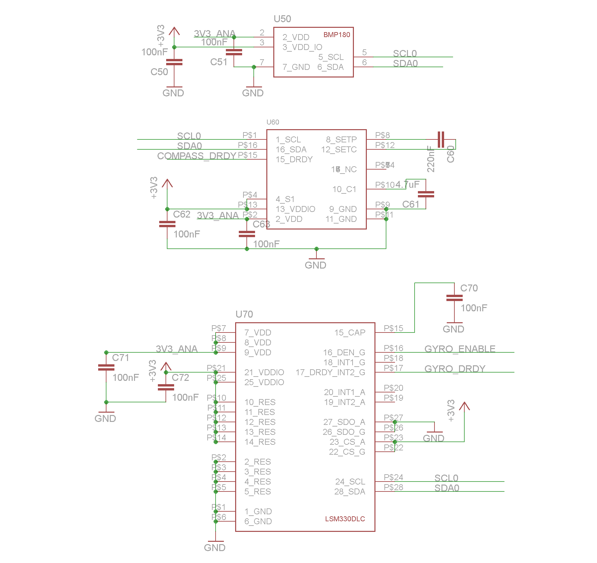

## Communication

For enhancing communication capabilities, a CAN bus interface chip is available onboard.

### CAN bus interface


## IOs

In addition to standard IOs, the board contains 4 N-channel MOS transistor outputs. These outputs are capable of driving motors and other electric loads within the limits of the power supply maximal current. 

### Output drive by MOS transistor
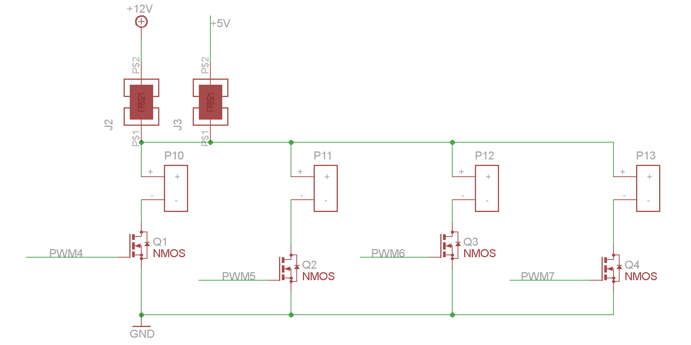

## Connectors

Different type of connectors are placed on the PCB to allow multiple connections with a variety of different sensors.

### Analogic

An analogic connector is placed onboard. Several inputs (ADC) and outputs (DCA) lines are available.
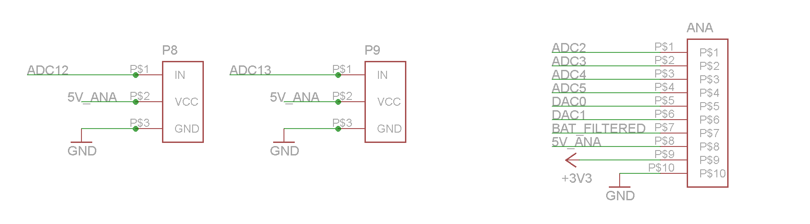

### I2C and SPI

I2C and SPI buses of the microcontroller are available outside the board through 4 I2C and 1 SPI connectors.
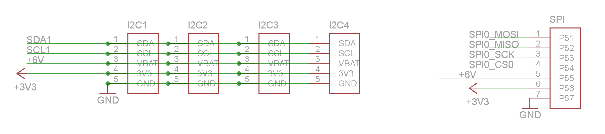

### GPS and Remote 

The GPS connector is a standard 5 pins connector. Watch out of TX and RX cables inversion in version 4.1 and 4.1.1.  
Two connectors for remote receiver are placed onboard allowing the capability of using two remotes.
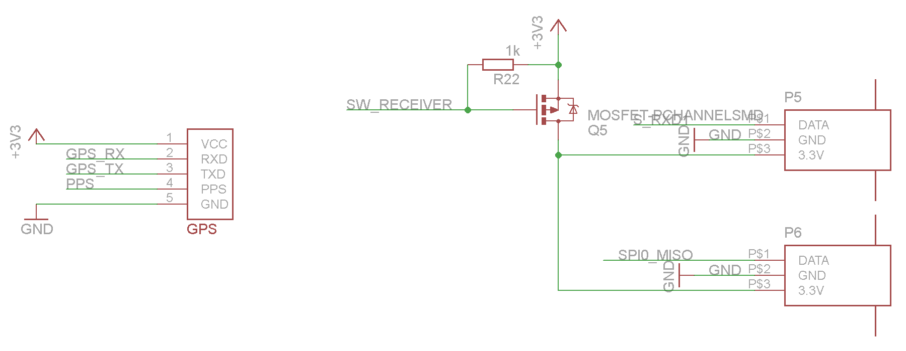

### Servos
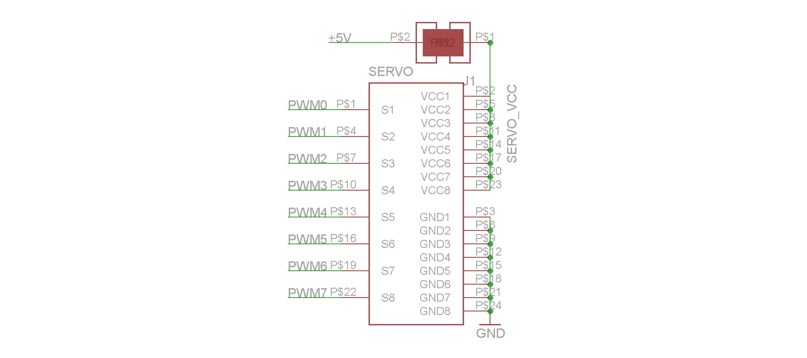

### SD card and XBee
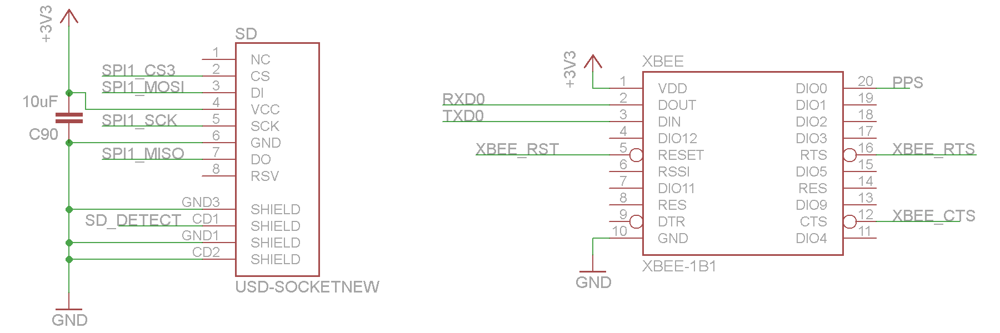
